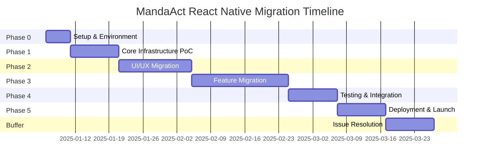

# MandaAct React Native Migration: Implementation Timeline

**Project Duration**: 14-16 weeks
**Start Date**: [To be determined]
**Target Launch**: Q1-Q2 2025
**Team Size**: 1-4 developers

---

## Timeline Overview



---

## Week-by-Week Breakdown

### Week 1: Project Setup & Environment
**Dates**: [Start] - [Start + 5 days]
**Sprint Goal**: Development environment ready, project initialized

| Day | Tasks | Deliverables | Responsible |
|-----|-------|-------------|-------------|
| **Mon** | • Create repository<br>• Initialize Expo project<br>• Configure TypeScript | Repository ready | Lead Dev |
| **Tue** | • Set up ESLint/Prettier<br>• Configure NativeWind<br>• Install core dependencies | Dev environment | Lead Dev |
| **Wed** | • EAS Build setup<br>• Configure environments<br>• CI/CD pipeline | Build system ready | DevOps |
| **Thu** | • Project structure<br>• Shared types setup<br>• Documentation | Code structure | Lead Dev |
| **Fri** | • Team onboarding<br>• Development guidelines<br>• First test build | Team ready | All |

**Milestone**: Empty app running on iOS/Android simulators ✓

---

### Week 2-3: Core Infrastructure PoC
**Sprint Goal**: Validate technical approach with working prototypes

#### Week 2: Authentication & Data Layer
| Day | Focus Area | Key Tasks | Success Criteria |
|-----|------------|-----------|------------------|
| **Mon** | Supabase Setup | • Configure client<br>• AsyncStorage integration<br>• Environment variables | Connection established |
| **Tue** | Auth Implementation | • Login screen<br>• Signup flow<br>• Session management | User can authenticate |
| **Wed** | State Management | • Port Zustand stores<br>• TanStack Query setup<br>• Cache configuration | State persists |
| **Thu** | Navigation | • Tab navigator<br>• Stack navigators<br>• Auth flow | Navigation works |
| **Fri** | Data Fetching | • Mandalart list<br>• Actions query<br>• Error handling | Data displays |

#### Week 3: OCR PoC & Basic UI
| Day | Focus Area | Key Tasks | Success Criteria |
|-----|------------|-----------|------------------|
| **Mon** | Image Handling | • Camera setup<br>• Gallery picker<br>• Image preview | Image selection works |
| **Tue** | OCR Integration | • Upload to Storage<br>• Edge Function call<br>• Result parsing | OCR processes image |
| **Wed** | Basic Components | • Button, Input<br>• Card, List<br>• Loading states | UI components ready |
| **Thu** | Home Screen | • Dashboard layout<br>• Stats display<br>• Quick actions | Home screen complete |
| **Fri** | Testing & Review | • PoC demo<br>• Technical review<br>• Decision points | PoC validated |

**Milestone**: OCR successfully processes mandalart image ✓

---

### Week 4-6: UI/UX Migration
**Sprint Goal**: Complete UI implementation with native feel

#### Week 4: Component Library
| Component Set | Items | Priority | Assigned To |
|---------------|-------|----------|-------------|
| **Forms** | Input, Button, Select, Checkbox | High | UI Dev |
| **Layout** | Container, Grid, Spacer, Divider | High | UI Dev |
| **Feedback** | Toast, Alert, Modal, Loading | High | UI Dev |
| **Display** | Card, List, Badge, Avatar | Medium | UI Dev |
| **Navigation** | Tabs, Header, Back button | High | Lead Dev |

#### Week 5: Core Screens
| Screen | Features | Complexity | Developer |
|--------|----------|------------|-----------|
| **Today's Practice** | • Grouped list<br>• Check animations<br>• Filters | High | Lead Dev |
| **Mandalart List** | • Grid/List view<br>• Search<br>• Activate toggle | Medium | Dev 2 |
| **Stats Dashboard** | • Charts<br>• Heatmap<br>• Progress | High | UI Dev |
| **Settings** | • Preferences<br>• Account<br>• Notifications | Low | Dev 2 |

#### Week 6: Complex Screens
| Screen | Features | Complexity | Developer |
|--------|----------|------------|-----------|
| **Mandalart Create** | • 3 input methods<br>• Preview<br>• AI suggestions | High | Lead Dev |
| **9x9 Grid View** | • Interactive grid<br>• Edit mode<br>• Performance | High | Lead Dev |
| **Reports** | • Markdown render<br>• Share function<br>• History | Medium | Dev 2 |
| **Tutorial** | • 7 steps<br>• Interactive<br>• Progress | Medium | UI Dev |

**Milestone**: All screens implemented and navigable ✓

---

### Week 7-10: Feature Migration & Optimization
**Sprint Goal**: Full feature parity with optimized performance

#### Week 7-8: Core Features
| Feature | Tasks | Priority | Testing |
|---------|-------|----------|---------|
| **Action Types** | • Port logic<br>• AI suggestions<br>• Display rules | High | Unit tests |
| **Check System** | • Daily checks<br>• History<br>• Sync | High | Integration |
| **XP/Level** | • Calculations<br>• Multipliers<br>• Animations | High | Unit tests |
| **Badges** | • Auto-unlock<br>• Notifications<br>• Display | High | E2E |
| **Streaks** | • Calculation<br>• Freeze logic<br>• Display | Medium | Unit tests |

#### Week 9-10: Advanced Features & Optimization
| Feature | Tasks | Priority | Testing |
|---------|-------|----------|---------|
| **Push Notifications** | • Permissions<br>• Scheduling<br>• Handlers | High | Manual |
| **Reports** | • Generation<br>• Caching<br>• Display | Medium | Integration |
| **Offline Mode** | • Cache strategy<br>• Sync logic<br>• Conflicts | Medium | Manual |
| **Performance** | • Image optimization<br>• List virtualization<br>• Bundle size | High | Profiling |

**Milestone**: Feature complete with <2s load time ✓

---

### Week 11-12: Testing & Platform Integration
**Sprint Goal**: Production-ready quality with all tests passing

#### Week 11: Testing Sprint
| Test Type | Coverage Target | Tools | Owner |
|-----------|----------------|-------|-------|
| **Unit Tests** | 80% | Jest | All Devs |
| **Component Tests** | 60% | RNTL | UI Dev |
| **Integration** | Critical paths | Jest + MSW | Lead Dev |
| **E2E Tests** | 5 key flows | Detox | QA |

**Key Test Scenarios**:
1. New user: Signup → Tutorial → Create mandalart → First check
2. Returning user: Login → Today's practice → Check actions → View stats
3. Creation flow: Each input method → Edit → Save
4. Gamification: Check action → XP gain → Badge unlock → Level up
5. Reports: Generate weekly report → View → Share

#### Week 12: Platform Configuration
| Platform | Tasks | Requirements | Owner |
|----------|-------|-------------|-------|
| **iOS** | • Certificates<br>• Provisioning<br>• App Store Connect<br>• TestFlight | Apple Developer Account | Lead Dev |
| **Android** | • Signing keys<br>• Play Console<br>• Internal testing<br>• Production track | Google Play Account | DevOps |

**Milestone**: Beta builds on TestFlight and Play Console ✓

---

### Week 13-14: Deployment & Launch
**Sprint Goal**: Successfully launch on both app stores

#### Week 13: Pre-Launch
| Task | Description | Duration | Owner |
|------|-------------|----------|-------|
| **Assets** | Screenshots, videos, descriptions | 2 days | Designer |
| **Store Listing** | Metadata, keywords, categories | 1 day | PM |
| **Beta Testing** | Internal team + 20 users | 2 days | QA |
| **Bug Fixes** | Critical issues from beta | 2 days | All Devs |

#### Week 14: Launch
| Day | iOS Tasks | Android Tasks | Marketing |
|-----|-----------|---------------|-----------|
| **Mon** | Submit to App Store | Submit to Play Store | Prepare announcements |
| **Tue** | Respond to review | Respond to review | Email list ready |
| **Wed** | Approval (hopefully) | Approval (faster) | Social media ready |
| **Thu** | Go live | Go live | Launch announcement |
| **Fri** | Monitor & hotfix | Monitor & hotfix | User support |

**Milestone**: App live on both stores ✓

---

### Week 15-16: Buffer & Post-Launch
**Sprint Goal**: Address issues and optimize based on user feedback

| Focus Area | Activities | Success Metrics |
|------------|------------|-----------------|
| **Monitoring** | • Crash reports<br>• Performance metrics<br>• User analytics | <0.5% crash rate |
| **User Feedback** | • App reviews<br>• Support tickets<br>• Feature requests | >4.0 rating |
| **Optimization** | • Performance tuning<br>• Bug fixes<br>• Quick wins | <2s load time |
| **Planning** | • Retrospective<br>• Next phase planning<br>• Roadmap update | Plan ready |

---

## Critical Path Dependencies

```
1. Expo Setup → Everything else
2. Supabase Integration → Data features
3. Navigation → Screen implementation
4. UI Components → Screen development
5. OCR PoC → Mandalart creation
6. Core Features → Testing
7. Testing → Store submission
8. Store approval → Launch
```

---

## Resource Allocation

### Team Roles & Responsibilities

| Role | Primary Responsibilities | Time Allocation |
|------|-------------------------|-----------------|
| **Lead Developer** | • Architecture<br>• Core features<br>• OCR integration<br>• Code review | 100% |
| **UI Developer** | • Component library<br>• Screen implementation<br>• Animations<br>• UX polish | 75% |
| **Developer 2** | • Feature implementation<br>• API integration<br>• Testing<br>• Bug fixes | 50% |
| **DevOps/QA** | • CI/CD<br>• Testing<br>• Deployment<br>• Monitoring | 25% |
| **Designer** | • App store assets<br>• UI refinements<br>• Icons/graphics | 20% |
| **Project Manager** | • Coordination<br>• Stakeholder comm<br>• Release management | 15% |

---

## Risk Mitigation Schedule

| Week | Risk Focus | Mitigation Actions |
|------|------------|-------------------|
| 1-2 | Technical feasibility | PoC validation, fallback options |
| 3-4 | UI complexity | Component library, design system |
| 5-6 | Performance issues | Early optimization, profiling |
| 7-8 | Feature complexity | Incremental implementation |
| 9-10 | Integration problems | Thorough testing, error handling |
| 11-12 | Platform issues | Early submission, compliance check |
| 13-14 | Store rejection | Review guidelines, prepare responses |
| 15-16 | User adoption | Marketing, onboarding optimization |

---

## Milestone Checklist

### Phase 0 Complete (Week 1)
- [ ] Repository created and configured
- [ ] Expo project initialized
- [ ] TypeScript and linting configured
- [ ] EAS Build working
- [ ] CI/CD pipeline active
- [ ] Team onboarded

### Phase 1 Complete (Week 3)
- [ ] Authentication working
- [ ] Supabase connected
- [ ] Navigation implemented
- [ ] OCR PoC functional
- [ ] Basic UI components ready
- [ ] State management working

### Phase 2 Complete (Week 6)
- [ ] All screens implemented
- [ ] Navigation complete
- [ ] UI polished and consistent
- [ ] Animations smooth
- [ ] Responsive layouts working
- [ ] Component library complete

### Phase 3 Complete (Week 10)
- [ ] Feature parity achieved
- [ ] Performance optimized
- [ ] Offline mode working
- [ ] Push notifications configured
- [ ] All integrations complete
- [ ] XP/Badge system working

### Phase 4 Complete (Week 12)
- [ ] All tests passing
- [ ] E2E tests automated
- [ ] Platform configurations done
- [ ] Beta builds distributed
- [ ] Performance targets met
- [ ] Security review passed

### Phase 5 Complete (Week 14)
- [ ] Store listings approved
- [ ] Apps published
- [ ] Marketing launched
- [ ] Users migrating
- [ ] Monitoring active
- [ ] Support ready

---

## Success Metrics by Week

| Week | Key Metrics | Target | Actual |
|------|------------|--------|--------|
| 1 | Setup complete | 100% | - |
| 2 | PoC features working | 3/3 | - |
| 3 | Screens implemented | 5 | - |
| 6 | UI migration | 100% | - |
| 8 | Features migrated | 80% | - |
| 10 | Features complete | 100% | - |
| 11 | Test coverage | >70% | - |
| 12 | Beta testers | 20+ | - |
| 13 | Store submission | 2/2 | - |
| 14 | App live | Yes | - |
| 15 | Crash rate | <0.5% | - |
| 16 | User rating | >4.0 | - |

---

## Daily Standup Format

```markdown
## [Date] Daily Standup

### Yesterday
- Completed: [tasks]
- Blockers: [issues]

### Today
- Focus: [main goal]
- Tasks: [specific items]

### Needs
- Help with: [items]
- Decisions: [pending]

### Metrics
- Progress: X%
- Velocity: on track/behind/ahead
```

---

## Weekly Review Format

```markdown
## Week [X] Review

### Accomplishments
- [List completed items]

### Challenges
- [Issues encountered]

### Next Week
- [Priority items]

### Risks
- [New or ongoing]

### Metrics
- Sprint goal: achieved/partial/missed
- Velocity: X story points
- Bug count: X
- Test coverage: X%
```

---

## Communication Plan

| Audience | Frequency | Format | Owner |
|----------|-----------|--------|-------|
| Development Team | Daily | Standup | Lead Dev |
| Stakeholders | Weekly | Status report | PM |
| Beta Testers | As needed | Email/Discord | QA |
| Users | Milestone | Blog/Email | Marketing |
| App Stores | As required | Store console | Lead Dev |

---

## Contingency Plans

### If Behind Schedule
1. Reduce scope (defer nice-to-have features)
2. Add resources (temporary help)
3. Extend timeline (communicate early)
4. Simplify implementation (MVP approach)

### If Technical Blocker
1. Find alternative solution
2. Consult external expert
3. Implement workaround
4. Document for future fix

### If Store Rejection
1. Address feedback immediately
2. Prepare detailed response
3. Make required changes
4. Resubmit within 24-48 hours

---

## Post-Launch Support Plan

### Week 15-16 Focus
- **Day 1-3**: Monitor crash reports, immediate fixes
- **Day 4-7**: Gather user feedback, prioritize issues
- **Week 2**: Performance optimization, bug fixes
- **Week 3**: Feature refinements based on feedback
- **Week 4**: Plan next phase, retrospective

### Ongoing (Month 2+)
- Weekly updates (bug fixes)
- Bi-weekly feature releases
- Monthly performance review
- Quarterly major updates

---

**Document Version**: 1.0
**Last Updated**: 2025-11-15
**Next Review**: End of Week 1
**Owner**: Project Manager

---

## Appendix: Quick Reference

### Key Dates (TBD)
- Project Start: [Date]
- PoC Complete: [Date]
- UI Complete: [Date]
- Feature Complete: [Date]
- Beta Launch: [Date]
- Store Submission: [Date]
- Public Launch: [Date]

### Important Links
- Repository: [GitHub link]
- Project Board: [Jira/Trello link]
- Design Files: [Figma link]
- Documentation: [Wiki link]
- Beta Testing: [TestFlight/Play link]
- Support: [Help desk link]

### Contact List
- Lead Developer: [Contact]
- Project Manager: [Contact]
- Emergency: [Contact]
- Apple Review: [Contact]
- Google Review: [Contact]

---

END OF TIMELINE