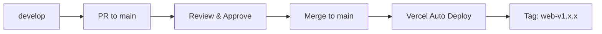
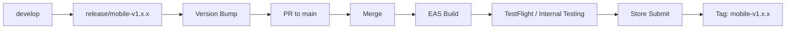

# MandaAct 버전 관리 전략

> **Version**: 1.0
> **Date**: 2025-11-26
> **Scope**: Web + React Native 통합 버전 관리

---

## 1. 리포지토리 구조 선택

### 1.1 옵션 비교

| 구조 | 장점 | 단점 |
|------|------|------|
| **모노레포 (권장)** | 코드 공유 용이, 일관된 버전, 원자적 변경 | 초기 설정 복잡, 빌드 시간 증가 가능 |
| 멀티레포 | 독립적 배포, 팀 분리 용이 | 코드 중복, 동기화 어려움 |

### 1.2 권장: 모노레포 (pnpm workspace)

```
mandaact/
├── package.json              # 워크스페이스 루트
├── pnpm-workspace.yaml
├── turbo.json                # Turborepo (빌드 캐싱)
│
├── apps/
│   ├── web/                  # 기존 Vite 웹앱
│   │   ├── package.json
│   │   ├── src/
│   │   └── ...
│   │
│   └── mobile/               # 새 Expo RN 앱
│       ├── package.json
│       ├── app.json
│       ├── src/
│       └── ...
│
├── packages/
│   ├── shared/               # 공유 로직
│   │   ├── package.json
│   │   ├── src/
│   │   │   ├── lib/          # actionTypes, xpMultipliers 등
│   │   │   ├── types/        # 타입 정의
│   │   │   └── constants/    # 공통 상수
│   │   └── tsconfig.json
│   │
│   ├── ui/                   # 공유 가능한 UI 로직 (선택)
│   │   └── package.json
│   │
│   └── config/               # 공유 설정
│       ├── eslint-config/
│       ├── tsconfig/
│       └── tailwind-config/
│
└── supabase/                 # Edge Functions (기존 유지)
    └── functions/
```

**pnpm-workspace.yaml:**
```yaml
packages:
  - 'apps/*'
  - 'packages/*'
```

**루트 package.json:**
```json
{
  "name": "mandaact",
  "private": true,
  "packageManager": "pnpm@9.0.0",
  "scripts": {
    "dev:web": "pnpm --filter @mandaact/web dev",
    "dev:mobile": "pnpm --filter @mandaact/mobile start",
    "build:web": "pnpm --filter @mandaact/web build",
    "build:mobile": "pnpm --filter @mandaact/mobile build",
    "lint": "turbo run lint",
    "type-check": "turbo run type-check",
    "test": "turbo run test"
  },
  "devDependencies": {
    "turbo": "^2.0.0"
  }
}
```

---

## 2. 버전 체계

### 2.1 시맨틱 버저닝 (SemVer)

```
MAJOR.MINOR.PATCH[-PRERELEASE][+BUILD]

예시:
1.0.0        # 첫 정식 릴리스
1.1.0        # 새 기능 추가 (하위 호환)
1.1.1        # 버그 수정
2.0.0        # Breaking Change
1.2.0-beta.1 # 베타 버전
```

**버전 증가 규칙:**

| 변경 유형 | 버전 증가 | 예시 |
|----------|----------|------|
| Breaking Change (API 변경) | MAJOR | 1.x.x → 2.0.0 |
| 새 기능 (하위 호환) | MINOR | 1.0.x → 1.1.0 |
| 버그 수정 | PATCH | 1.0.0 → 1.0.1 |
| 베타/알파 | PRERELEASE | 1.1.0-beta.1 |

### 2.2 플랫폼별 버전 관리

#### Web (기존)
```json
// apps/web/package.json
{
  "name": "@mandaact/web",
  "version": "1.0.0"
}
```

#### Mobile (iOS + Android)
```json
// apps/mobile/app.json
{
  "expo": {
    "version": "1.0.0",
    "ios": {
      "buildNumber": "1"
    },
    "android": {
      "versionCode": 1
    }
  }
}
```

**버전 vs 빌드번호:**

| 구분 | 용도 | 규칙 |
|------|------|------|
| `version` | 사용자 표시용 (App Store) | SemVer, 릴리스마다 증가 |
| `buildNumber` (iOS) | 내부 빌드 식별 | 숫자, 매 빌드마다 증가 |
| `versionCode` (Android) | Google Play 식별 | 정수, 항상 증가 (감소 불가) |

**빌드 번호 전략:**
```
# 옵션 A: 단순 증가
1, 2, 3, 4, ...

# 옵션 B: 날짜 기반 (권장)
YYYYMMDDHH 형식
2025112601, 2025112602, ...

# 옵션 C: 버전 연동
Major*10000 + Minor*100 + Patch + Build
1.2.3 빌드 5 → 10203005
```

### 2.3 공유 패키지 버전

```json
// packages/shared/package.json
{
  "name": "@mandaact/shared",
  "version": "1.0.0",
  "main": "src/index.ts",
  "types": "src/index.ts",
  "exports": {
    ".": "./src/index.ts",
    "./lib/*": "./src/lib/*.ts",
    "./types": "./src/types/index.ts"
  }
}
```

**의존성 선언:**
```json
// apps/web/package.json
{
  "dependencies": {
    "@mandaact/shared": "workspace:*"
  }
}

// apps/mobile/package.json
{
  "dependencies": {
    "@mandaact/shared": "workspace:*"
  }
}
```

---

## 3. Git 브랜치 전략

### 3.1 GitFlow 변형 (권장)

```
main (production)
  │
  ├── develop (개발 통합)
  │     │
  │     ├── feature/web-*      # 웹 전용 기능
  │     ├── feature/mobile-*   # 모바일 전용 기능
  │     ├── feature/shared-*   # 공유 코드 변경
  │     └── feature/*          # 공통 기능
  │
  ├── release/v1.x.x           # 릴리스 준비
  │
  └── hotfix/v1.x.x            # 긴급 수정
```

### 3.2 브랜치 명명 규칙

```bash
# 기능 개발
feature/web-dark-mode          # 웹 전용
feature/mobile-push-setup      # 모바일 전용
feature/shared-xp-formula      # 공유 로직
feature/auth-refresh           # 공통

# 버그 수정
fix/web-grid-overflow
fix/mobile-crash-on-launch
fix/shared-timezone-calc

# 릴리스
release/v1.2.0
release/mobile-v1.0.0          # 플랫폼별 릴리스

# 핫픽스
hotfix/v1.2.1
```

### 3.3 브랜치 보호 규칙

**main 브랜치:**
- PR 필수
- CI 통과 필수
- 최소 1명 승인 필요
- 직접 푸시 금지

**develop 브랜치:**
- PR 권장
- CI 통과 필수

### 3.4 커밋 메시지 컨벤션

**Conventional Commits:**
```
<type>(<scope>): <subject>

[optional body]

[optional footer]
```

**타입:**
| Type | 설명 |
|------|------|
| `feat` | 새 기능 |
| `fix` | 버그 수정 |
| `docs` | 문서 변경 |
| `style` | 코드 스타일 (포맷팅) |
| `refactor` | 리팩토링 |
| `perf` | 성능 개선 |
| `test` | 테스트 추가/수정 |
| `chore` | 빌드, 설정 변경 |

**스코프:**
| Scope | 설명 |
|-------|------|
| `web` | 웹 앱 전용 |
| `mobile` | 모바일 앱 전용 |
| `shared` | 공유 패키지 |
| `edge` | Edge Functions |
| `ci` | CI/CD |

**예시:**
```bash
feat(mobile): add push notification setup
fix(web): resolve grid overflow on mobile viewport
feat(shared): update XP multiplier formula
chore(ci): add EAS build workflow
docs: update migration plan
```

---

## 4. 릴리스 워크플로우

### 4.1 웹 릴리스 (Vercel 자동 배포)



**수동 태깅:**
```bash
git tag -a web-v1.2.0 -m "Web release v1.2.0"
git push origin web-v1.2.0
```

### 4.2 모바일 릴리스 (EAS Build)



**버전 업데이트 스크립트:**
```bash
#!/bin/bash
# scripts/bump-mobile-version.sh

VERSION=$1
BUILD_NUMBER=$(date +%Y%m%d%H)

# app.json 업데이트
cd apps/mobile
npx json -I -f app.json -e "this.expo.version='$VERSION'"
npx json -I -f app.json -e "this.expo.ios.buildNumber='$BUILD_NUMBER'"
npx json -I -f app.json -e "this.expo.android.versionCode=$BUILD_NUMBER"

echo "Updated to version $VERSION, build $BUILD_NUMBER"
```

**사용:**
```bash
./scripts/bump-mobile-version.sh 1.2.0
```

### 4.3 EAS Build 명령어

```bash
# 개발 빌드 (Expo Go 대신)
eas build --profile development --platform all

# 내부 테스트 빌드
eas build --profile preview --platform all

# 프로덕션 빌드
eas build --profile production --platform all

# 스토어 제출
eas submit --platform ios
eas submit --platform android
```

### 4.4 OTA 업데이트 (Expo Updates)

**긴급 수정 시 스토어 심사 없이 배포:**
```bash
# JavaScript 번들만 업데이트 (네이티브 코드 변경 없을 때)
eas update --branch production --message "Fix critical bug"
```

**app.json 설정:**
```json
{
  "expo": {
    "updates": {
      "url": "https://u.expo.dev/your-project-id",
      "fallbackToCacheTimeout": 30000
    },
    "runtimeVersion": {
      "policy": "sdkVersion"
    }
  }
}
```

---

## 5. CI/CD 파이프라인

### 5.1 GitHub Actions 워크플로우

**PR 검증 (모든 PR):**
```yaml
# .github/workflows/pr-check.yml
name: PR Check

on:
  pull_request:
    branches: [main, develop]

jobs:
  lint-and-test:
    runs-on: ubuntu-latest
    steps:
      - uses: actions/checkout@v4

      - uses: pnpm/action-setup@v2
        with:
          version: 9

      - uses: actions/setup-node@v4
        with:
          node-version: 20
          cache: 'pnpm'

      - run: pnpm install

      - name: Type Check
        run: pnpm type-check

      - name: Lint
        run: pnpm lint

      - name: Test
        run: pnpm test

      - name: Build Web
        run: pnpm build:web

  # 모바일 변경 시에만 실행
  check-mobile:
    runs-on: ubuntu-latest
    if: contains(github.event.pull_request.changed_files, 'apps/mobile')
    steps:
      - uses: actions/checkout@v4
      - uses: expo/expo-github-action@v8
        with:
          eas-version: latest
          token: ${{ secrets.EXPO_TOKEN }}
      # Expo Doctor 검사
      - run: cd apps/mobile && npx expo-doctor
```

**웹 배포 (main 머지 시):**
```yaml
# .github/workflows/deploy-web.yml
name: Deploy Web

on:
  push:
    branches: [main]
    paths:
      - 'apps/web/**'
      - 'packages/shared/**'

jobs:
  deploy:
    runs-on: ubuntu-latest
    steps:
      - uses: actions/checkout@v4

      - uses: pnpm/action-setup@v2
        with:
          version: 9

      - run: pnpm install
      - run: pnpm build:web

      # Vercel은 자동 배포하므로 태깅만
      - name: Create Tag
        if: github.ref == 'refs/heads/main'
        run: |
          VERSION=$(node -p "require('./apps/web/package.json').version")
          git tag web-v$VERSION
          git push origin web-v$VERSION
```

**모바일 빌드 (수동 또는 태그 시):**
```yaml
# .github/workflows/build-mobile.yml
name: Build Mobile

on:
  workflow_dispatch:
    inputs:
      platform:
        description: 'Platform to build'
        required: true
        default: 'all'
        type: choice
        options:
          - all
          - ios
          - android
      profile:
        description: 'Build profile'
        required: true
        default: 'preview'
        type: choice
        options:
          - development
          - preview
          - production

jobs:
  build:
    runs-on: ubuntu-latest
    steps:
      - uses: actions/checkout@v4

      - uses: expo/expo-github-action@v8
        with:
          eas-version: latest
          token: ${{ secrets.EXPO_TOKEN }}

      - uses: pnpm/action-setup@v2
        with:
          version: 9

      - run: pnpm install

      - name: Build
        working-directory: apps/mobile
        run: |
          eas build \
            --profile ${{ inputs.profile }} \
            --platform ${{ inputs.platform }} \
            --non-interactive
```

### 5.2 빌드 매트릭스

```yaml
# 여러 플랫폼 동시 빌드
jobs:
  build:
    strategy:
      matrix:
        platform: [ios, android]
        include:
          - platform: ios
            runs-on: macos-latest
          - platform: android
            runs-on: ubuntu-latest
```

---

## 6. 의존성 관리

### 6.1 패키지 버전 동기화

**pnpm의 catalog 기능 (권장):**
```yaml
# pnpm-workspace.yaml
packages:
  - 'apps/*'
  - 'packages/*'

catalog:
  react: ^18.3.1
  typescript: ^5.5.4
  '@tanstack/react-query': ^5.56.0
  zustand: ^4.5.5
  date-fns: ^3.6.0
  '@supabase/supabase-js': ^2.45.0
```

**사용:**
```json
// apps/web/package.json
{
  "dependencies": {
    "react": "catalog:",
    "@tanstack/react-query": "catalog:"
  }
}

// apps/mobile/package.json
{
  "dependencies": {
    "react": "catalog:",
    "@tanstack/react-query": "catalog:"
  }
}
```

### 6.2 의존성 업데이트 전략

**Renovate Bot 설정:**
```json
// renovate.json
{
  "$schema": "https://docs.renovatebot.com/renovate-schema.json",
  "extends": ["config:recommended"],
  "packageRules": [
    {
      "groupName": "React",
      "matchPackagePatterns": ["^react", "^@types/react"]
    },
    {
      "groupName": "Expo",
      "matchPackagePatterns": ["^expo", "^@expo"]
    },
    {
      "groupName": "TanStack",
      "matchPackagePatterns": ["^@tanstack"]
    },
    {
      "matchUpdateTypes": ["major"],
      "labels": ["breaking-change"],
      "automerge": false
    },
    {
      "matchUpdateTypes": ["minor", "patch"],
      "automerge": true,
      "automergeType": "branch"
    }
  ],
  "schedule": ["before 9am on monday"]
}
```

### 6.3 Lock 파일 관리

```bash
# pnpm-lock.yaml 항상 커밋
# node_modules는 .gitignore

# 의존성 설치 (CI에서)
pnpm install --frozen-lockfile

# 의존성 업데이트 후
pnpm install
git add pnpm-lock.yaml
git commit -m "chore: update dependencies"
```

---

## 7. 환경 변수 관리

### 7.1 환경별 설정

```
apps/mobile/
├── .env.development    # 개발
├── .env.preview        # 내부 테스트
├── .env.production     # 프로덕션
└── .env.local          # 로컬 (gitignore)

apps/web/
├── .env.development
├── .env.production
└── .env.local          # 로컬 (gitignore)
```

### 7.2 비밀 값 관리

```bash
# EAS Secrets (모바일)
eas secret:create --name SENTRY_DSN --value "xxx" --scope project
eas secret:create --name POSTHOG_API_KEY --value "xxx" --scope project

# Vercel Secrets (웹)
vercel env add SENTRY_DSN production
vercel env add POSTHOG_API_KEY production

# Supabase Secrets (Edge Functions)
supabase secrets set GCP_PRIVATE_KEY="xxx"
supabase secrets set PERPLEXITY_API_KEY="xxx"
```

### 7.3 환경 변수 검증

```typescript
// packages/shared/src/lib/env.ts
import { z } from 'zod'

const envSchema = z.object({
  SUPABASE_URL: z.string().url(),
  SUPABASE_ANON_KEY: z.string().min(1),
  SENTRY_DSN: z.string().url().optional(),
})

export function validateEnv() {
  const parsed = envSchema.safeParse({
    SUPABASE_URL: process.env.EXPO_PUBLIC_SUPABASE_URL || process.env.VITE_SUPABASE_URL,
    SUPABASE_ANON_KEY: process.env.EXPO_PUBLIC_SUPABASE_ANON_KEY || process.env.VITE_SUPABASE_ANON_KEY,
    SENTRY_DSN: process.env.EXPO_PUBLIC_SENTRY_DSN || process.env.VITE_SENTRY_DSN,
  })

  if (!parsed.success) {
    console.error('Invalid environment variables:', parsed.error.flatten())
    throw new Error('Invalid environment configuration')
  }

  return parsed.data
}
```

---

## 8. 버전 동기화 체크리스트

### 8.1 릴리스 전 체크리스트

**공통:**
- [ ] 모든 테스트 통과
- [ ] lint 오류 없음
- [ ] 타입 체크 통과
- [ ] CHANGELOG.md 업데이트

**웹:**
- [ ] `apps/web/package.json` 버전 업데이트
- [ ] Production 빌드 성공
- [ ] Lighthouse 점수 확인

**모바일:**
- [ ] `apps/mobile/app.json` 버전 업데이트
- [ ] iOS `buildNumber` 증가
- [ ] Android `versionCode` 증가
- [ ] EAS preview 빌드 테스트
- [ ] TestFlight / Internal Testing 배포

**공유 패키지 변경 시:**
- [ ] `packages/shared/package.json` 버전 업데이트
- [ ] 웹/모바일 모두 테스트
- [ ] Breaking change 시 MAJOR 버전 증가

### 8.2 버전 불일치 방지

```bash
#!/bin/bash
# scripts/check-versions.sh

SHARED_VERSION=$(node -p "require('./packages/shared/package.json').version")
WEB_DEP=$(node -p "require('./apps/web/package.json').dependencies['@mandaact/shared']")
MOBILE_DEP=$(node -p "require('./apps/mobile/package.json').dependencies['@mandaact/shared']")

echo "Shared package version: $SHARED_VERSION"
echo "Web depends on: $WEB_DEP"
echo "Mobile depends on: $MOBILE_DEP"

# workspace:* 사용 시 자동 동기화되므로 경고만
if [[ "$WEB_DEP" != "workspace:*" ]] || [[ "$MOBILE_DEP" != "workspace:*" ]]; then
  echo "Warning: Consider using 'workspace:*' for automatic version sync"
fi
```

---

## 9. 롤백 전략

### 9.1 웹 롤백

```bash
# Vercel 대시보드에서 이전 배포로 롤백 (1클릭)
# 또는 CLI
vercel rollback

# Git 태그 기반 재배포
git checkout web-v1.1.0
vercel --prod
```

### 9.2 모바일 롤백

**OTA 롤백 (JS 번들만):**
```bash
# 이전 업데이트로 롤백
eas update --branch production --message "Rollback to previous version"
```

**스토어 롤백:**
- **iOS**: App Store Connect에서 이전 버전으로 롤백 불가, 새 버전으로 수정 배포 필요
- **Android**: Google Play Console에서 단계적 출시 중단 후 이전 버전 활성화 가능

**긴급 대응:**
```bash
# 1. OTA로 즉시 수정 배포
eas update --branch production --message "Emergency fix"

# 2. 새 빌드 & 스토어 제출
eas build --profile production --platform all
eas submit --platform all
```

---

## 10. 버전 히스토리 추적

### 10.1 CHANGELOG.md 형식

```markdown
# Changelog

All notable changes to this project will be documented in this file.

## [Unreleased]

### Added
- ...

### Changed
- ...

### Fixed
- ...

## [1.2.0] - 2025-12-01

### Added
- (web) Dark mode toggle
- (mobile) Push notification support
- (shared) New XP multiplier types

### Changed
- (shared) Updated badge evaluation logic

### Fixed
- (web) Grid overflow on mobile viewport
- (mobile) Crash on app launch with no network

## [1.1.0] - 2025-11-15

### Added
- (mobile) Initial React Native app release
- ...
```

### 10.2 자동 CHANGELOG 생성

```bash
# conventional-changelog 사용
npx conventional-changelog -p angular -i CHANGELOG.md -s

# 또는 release-please (GitHub Action)
```

**GitHub Action:**
```yaml
# .github/workflows/release-please.yml
name: Release Please

on:
  push:
    branches: [main]

jobs:
  release-please:
    runs-on: ubuntu-latest
    steps:
      - uses: google-github-actions/release-please-action@v4
        with:
          release-type: node
          package-name: mandaact
          monorepo-tags: true
```

---

## 11. 요약: 버전 관리 규칙

| 항목 | 규칙 |
|------|------|
| **버전 형식** | SemVer (MAJOR.MINOR.PATCH) |
| **브랜치 전략** | GitFlow 변형 (main, develop, feature/*, release/*) |
| **커밋 메시지** | Conventional Commits |
| **공유 패키지** | `workspace:*` 의존성 |
| **웹 배포** | main 머지 → Vercel 자동 배포 |
| **모바일 배포** | EAS Build → TestFlight/Internal → Store |
| **긴급 수정** | OTA Update (JS 번들) |
| **태그 형식** | `web-v1.x.x`, `mobile-v1.x.x`, `shared-v1.x.x` |

---

## 12. 변경 이력

| 버전 | 날짜 | 변경 내용 |
|------|------|-----------|
| 1.0 | 2025-11-26 | 초안 작성 |
